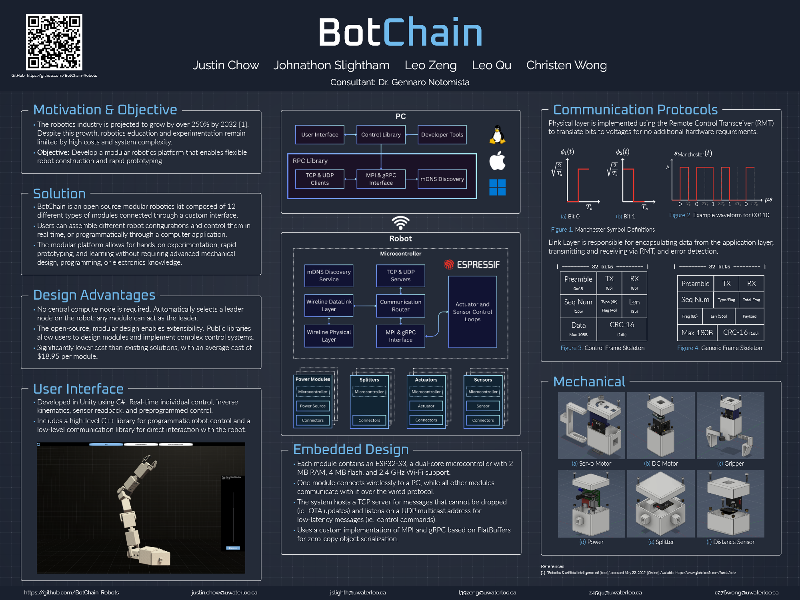

# BotChain

BotChain is an open-source modular robotics kit composed of 12 different types of modules connected through a custom interface. Users can assemble different robot configurations and control them in real time, or programmatically through a computer application. The modular platform allows for hands-on experimentation, rapid prototyping, and learning without requiring advanced mechanical design, programming, or electronics knowledge.

## Repositories

- [Firmware](https://github.com/BotChain-Robots/firmware): Repository that contains the ESP32-S3 firmware that make up the modules in BotChain. Each module should be flashed with the firmware binary produced after compiling this repository.
- [CAD](https://github.com/BotChain-Robots/cad): Repository that contains the Fusion 360 CAD Drawings of the modules. Specifically, the drawings contain models for the module shells, servo arms, gripper arms, and other models that can be printed via a 3D printer.
- [RPC](https://github.com/BotChain-Robots/rpc): Repository that contains a custom RPC library to enable BotChain modules to communicate with a PC over TCP and UDP, with mDNS discovery
- [Control](https://github.com/BotChain-Robots/control): Repository that contains the PC level Control Library to control specific types of modules
- [UI](https://github.com/BotChain-Robots/ui): Repository that contains the UI, using Unity, for displaying and interacting with the detected robot topologies

## Example Robotic Topologies

- [Car 🚗](https://drive.google.com/drive/folders/1RVNF4ZkpOTs3NDFS7xf5RE3f5HVA9AV7?usp=drive_link)
- [Lobster 🦞](https://drive.google.com/drive/folders/1oPuAS2W_lYi8w9NoP8gTsph5K_K8Zc2D?usp=drive_link)
- [Arm 💪](https://drive.google.com/drive/folders/1QdX6A_WlV2ssUTr-TJq_0-XsCD9oNEHi?usp=drive_link)

## Informational Poster

## Original Authors

Created by Justin Chow, Johnathon Slightham, Leo Zeng, Leo Qu, and Christen Wong. 

Special thanks to our consultant, [Dr. Gennaro Notomista](https://uwaterloo.ca/electrical-computer-engineering/profile/gnotomis). Without his support and input, this project would not have been possible.

Presented at the University of Waterloo, Department of Electrical and Computer Engineering's [2026 Capstone Symposium](https://uwaterloo.ca/capstone-design/project-abstracts/2026-capstone-design-projects/2026-electrical-and-computer-engineering-capstone-designs#2)!

